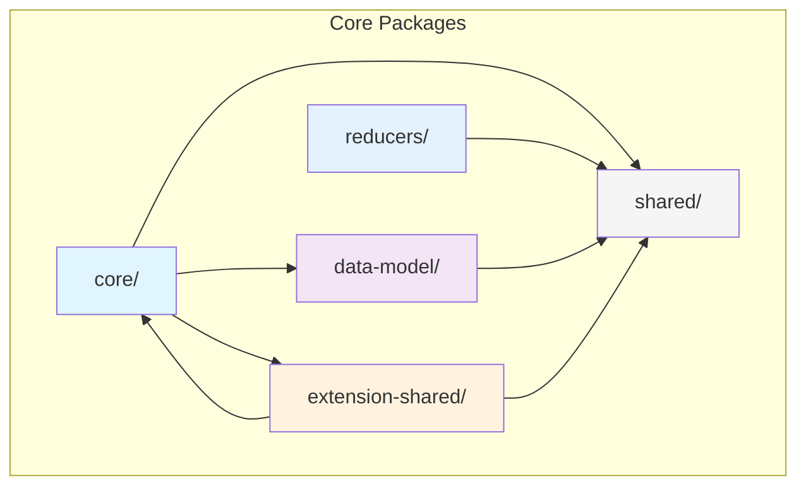

# Flow Reference Wallet Core - Package Architecture

## Overview

This document outlines the architectural design and dependency rules for the Flow Reference Wallet Core packages. The packages are designed with strict separation of concerns and clear dependency boundaries to ensure maintainability, reusability, and testability.

## Package Structure

```
packages/
├── shared/            # @onflow/frw-shared
├── core/              # @onflow/frw-core
├── reducers/          # @onflow/frw-reducers
├── data-model/        # @onflow/frw-data-model
└── extension-shared/  # @onflow/frw-extension-shared
```

## Architecture Diagram



## Package Responsibilities

### 1. Shared Package (`@onflow/frw-shared`)

- **Purpose**: Foundation package with common utilities and types
- **Responsibilities**:
  - Type definitions for Flow blockchain entities
  - Common utility functions
  - Constants and enums
  - Shared interfaces
- **Dependencies**: None (standalone package)
- **Used by**: All other packages

### 2. Core Package (`@onflow/frw-core`)

- **Purpose**: Core business logic and services
- **Responsibilities**:
  - Wallet services (keyring, transactions, signing)
  - Flow blockchain interactions
  - Account management
  - Security operations
  - Business logic implementation
- **Can import from**: 
  - `@onflow/frw-shared`
  - `@onflow/frw-data-model`
  - `@onflow/frw-extension-shared`
- **Cannot import from**: UI-specific packages or application code

### 3. Reducers Package (`@onflow/frw-reducers`)

- **Purpose**: Pure state management functions
- **Responsibilities**:
  - State reduction logic
  - Data transformations
  - Action handling
  - Pure state update functions
- **Can import from**: `@onflow/frw-shared` only
- **Design principle**: Must remain pure with no side effects

### 4. Data Model Package (`@onflow/frw-data-model`)

- **Purpose**: Cache and data management strategies
- **Responsibilities**:
  - Cache implementation
  - Data persistence interfaces
  - Storage abstraction
  - TTL management
  - Data synchronization patterns
- **Can import from**: `@onflow/frw-shared` only
- **Design principle**: Storage-agnostic implementation

### 5. Extension Shared Package (`@onflow/frw-extension-shared`)

- **Purpose**: Browser extension specific utilities
- **Responsibilities**:
  - Chrome API wrappers
  - Extension messaging utilities
  - Browser-specific helpers
  - Extension lifecycle management
- **Can import from**: 
  - `@onflow/frw-shared`
  - `@onflow/frw-core`
- **Note**: Contains browser-specific code

## Dependency Rules

### Strict Dependency Hierarchy

1. **Shared Package**: No dependencies (foundation layer)
2. **Data Model & Reducers**: Depend only on Shared
3. **Core Package**: Can use Shared, Data Model, and Extension Shared
4. **Extension Shared**: Can use Shared and Core

### Import Examples

```typescript
// ✅ Correct - Shared has no dependencies
// In @onflow/frw-shared
export interface Account {
  address: string;
  balance: number;
}

// ✅ Correct - Core importing from allowed packages
// In @onflow/frw-core
import { Account } from '@onflow/frw-shared/types';
import { CacheModel } from '@onflow/frw-data-model';
import { messaging } from '@onflow/frw-extension-shared';

// ✅ Correct - Reducers only import from shared
// In @onflow/frw-reducers
import { Account } from '@onflow/frw-shared/types';

// ❌ Wrong - Reducers cannot import from core
import { WalletService } from '@onflow/frw-core'; // Not allowed!

// ❌ Wrong - Shared cannot import from other packages
// In @onflow/frw-shared
import { CacheModel } from '@onflow/frw-data-model'; // Not allowed!
```

## Design Principles

### 1. Zero Platform Dependencies

Packages should work in any JavaScript environment where possible:
- No direct browser APIs in core packages
- Platform-specific code isolated to extension-shared
- Use dependency injection for platform features

### 2. Type Safety

All packages use TypeScript with strict mode:
- Full type coverage
- No implicit any
- Strict null checks
- Comprehensive type exports

### 3. Tree Shaking

Packages are optimized for bundle size:
- ESM exports for tree shaking
- Granular exports
- No side effects in module initialization
- Separate entry points for different features

### 4. Pure Functions

Especially important for reducers:
- No side effects
- Predictable outputs
- Immutable updates
- Testable in isolation

## Package Development Guidelines

### Creating New Functionality

1. **Determine the appropriate package**:
   - Common types/utils → `shared`
   - Business logic → `core`
   - State transformations → `reducers`
   - Caching logic → `data-model`
   - Browser-specific → `extension-shared`

2. **Follow the dependency hierarchy**:
   - Check allowed imports for the package
   - Don't create circular dependencies
   - Keep packages focused on their purpose

3. **Export patterns**:
   ```typescript
   // Package index.ts
   export * from './types';
   export * from './utils';
   export { specificFunction } from './specific-module';
   ```

### Testing Strategy

Each package should have:
- Unit tests for all exported functions
- Type tests for TypeScript definitions
- Integration tests where appropriate
- Mock implementations for testing consumers

### Versioning

- Follow semantic versioning
- Maintain backward compatibility
- Document breaking changes
- Use workspace protocol for internal dependencies

## Benefits

This architecture provides:

1. **Reusability**: Packages can be used in different contexts (extension, mobile, web)
2. **Maintainability**: Clear boundaries and responsibilities
3. **Testability**: Isolated packages are easier to test
4. **Type Safety**: Strong typing across package boundaries
5. **Performance**: Tree-shaking and optimized bundles
6. **Flexibility**: Easy to add new packages or modify existing ones

## Common Patterns

### Service Pattern (Core Package)

```typescript
// In @onflow/frw-core
export class WalletService {
  constructor(private storage: StorageInterface) {}
  
  async getAccounts(): Promise<Account[]> {
    // Implementation
  }
}
```

### Reducer Pattern (Reducers Package)

```typescript
// In @onflow/frw-reducers
export function accountReducer(
  state: AccountState,
  action: AccountAction
): AccountState {
  switch (action.type) {
    case 'ADD_ACCOUNT':
      return { ...state, accounts: [...state.accounts, action.payload] };
    default:
      return state;
  }
}
```

### Cache Pattern (Data Model Package)

```typescript
// In @onflow/frw-data-model
export class CacheModel<T> {
  constructor(private ttl: number) {}
  
  async get(key: string): Promise<T | null> {
    // Implementation
  }
  
  async set(key: string, value: T): Promise<void> {
    // Implementation
  }
}
```

This architecture ensures a maintainable, scalable, and reusable codebase for the Flow Reference Wallet ecosystem.